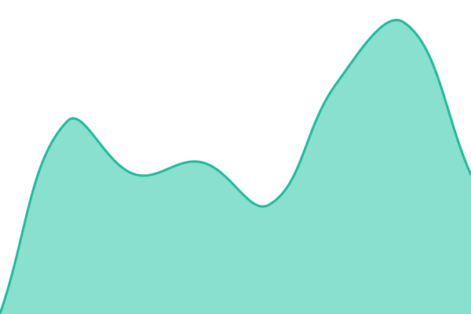
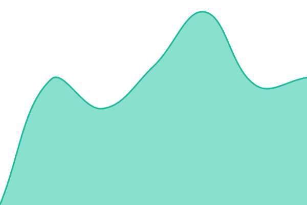
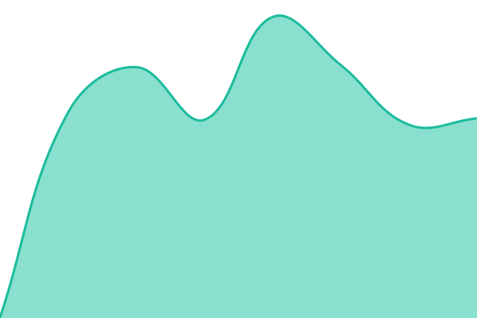
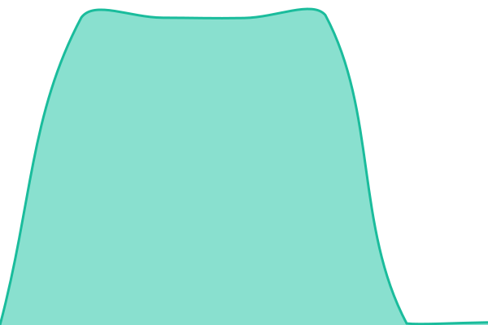
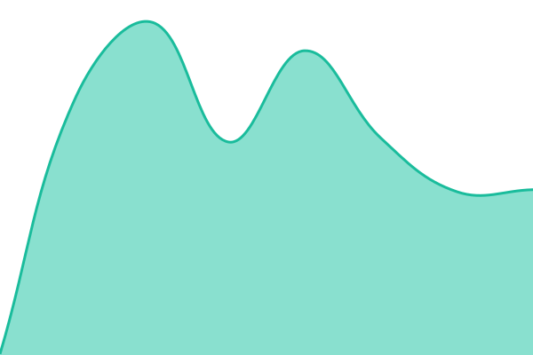

# Boarda Status

Live status: <!--live status--> **🟧 Partial outage**

<!--start: status pages-->
<!-- This summary is generated by Upptime (https://github.com/upptime/upptime) -->
<!-- Do not edit this manually, your changes will be overwritten -->
<!-- prettier-ignore -->
| URL | Status | History | Response Time | Uptime |
| --- | ------ | ------- | ------------- | ------ |
|  [Boarda Studio](https://beta.studio.boarda.io) | 🟩 Up | [studio.yml](https://github.com/boarda/boarda-status/commits/HEAD/history/studio.yml) | 

 626ms
     
 | 

<a href="https://status.boarda.io/history/studio">95.60%</a>
    

|  [Boarda Account](https://account.boarda.io) | 🟩 Up | [account.yml](https://github.com/boarda/boarda-status/commits/HEAD/history/account.yml) | 

 612ms
     
 | 

<a href="https://status.boarda.io/history/account">95.61%</a>
    

|  [Boarda Developers](https://developers.boarda.io) | 🟥 Down | [developers.yml](https://github.com/boarda/boarda-status/commits/HEAD/history/developers.yml) | 

 3302ms
     
 | 

<a href="https://status.boarda.io/history/developers">83.59%</a>
    

|  [Boarda Cast](https://cast.boarda.io/api/health) | 🟥 Down | [cast.yml](https://github.com/boarda/boarda-status/commits/HEAD/history/cast.yml) | 

 2835ms
     
 | 

<a href="https://status.boarda.io/history/cast">83.59%</a>
    

|  [Boarda API Gateway](https://api.boarda.io/_health) | 🟩 Up | [api-gateway.yml](https://github.com/boarda/boarda-status/commits/HEAD/history/api-gateway.yml) | 

 381ms
     
 | 

<a href="https://status.boarda.io/history/api-gateway">95.61%</a>
    

|  [Boarda Website](https://boarda.io) | 🟩 Up | [website.yml](https://github.com/boarda/boarda-status/commits/HEAD/history/website.yml) | 

 661ms
     
 | 

<a href="https://status.boarda.io/history/website">98.84%</a>
    

<!--end: status pages-->

Powered by [Upptime](https://github.com/upptime/upptime).
